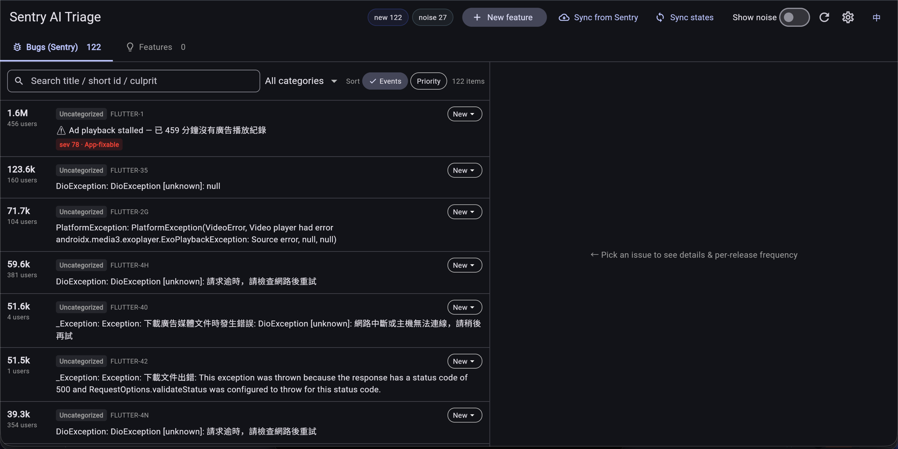
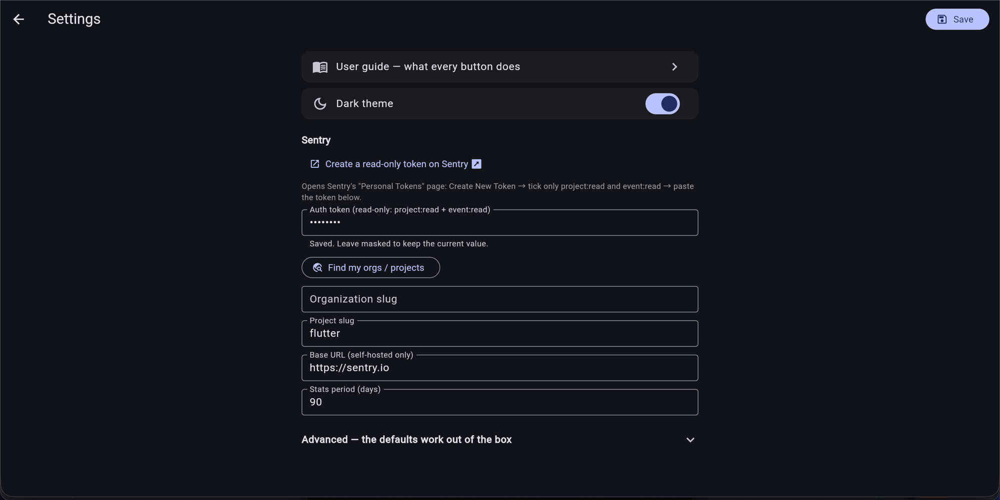

# Sentry AI Triage

**English** · [繁體中文](#zh-hant)

Self-hosted Sentry issue triage with AI analysis — powered by the Claude
subscription you already pay for, instead of a separate AI add-on.

```
Sentry ingest → rule-based noise filtering → long-term trends
             → AI severity / root-cause analysis (cost-guarded)
             → GitHub tickets (@claude discussion) → AI draft PRs → human review
```

Built for teams whose Sentry feed is dominated by unfixable noise (device
firmware crashes, flaky networks) with real app bugs buried in between —
common for mobile / IoT / kiosk apps.



## What it does

- **Ingest** issues from Sentry (REST API, auto-pagination) into a local
  SQLite DB, snapshotting every run so trends survive Sentry's retention
  window.
- **Auto-triage rules** mark known device-layer / network noise
  (`DeadSystemException`, `libGLES_mali`, GC/firmware crashes, timeouts…) as
  `known_noise` before any AI runs — zero cost, zero misclassified app bugs.
  Rules are seeded from `rules/default_rules.json` and editable in the DB.
- **AI analysis** of what's left: severity (0–100), app-fixable or not, root
  cause, recommended action, confidence. Runs through the **Claude Code CLI**
  (uses your subscription, no API cost) or the **Anthropic API** — your
  choice.
- **Web UI** (Flutter Web, English / 繁體中文): triage list with per-release
  frequency bars, manual re-classification, feature backlog with AI
  feasibility analysis (it reads your actual repo), and in-app Settings — no
  config files needed.
- **GitHub integration**: one click opens a ticket with the analysis and
  auto-@claude's it to start a discussion; a second click asks for an AI
  draft PR (opened as draft, never merged without human review). Ticket/PR
  states sync back.
- **Cost guardrails**: minimum event count before AI, per-batch cap, content
  hashing so unchanged issues are never re-analyzed, noise never sent.

## Quick start

### 1 · Install the prerequisites (once)

| Tool | Needed for | Notes |
|---|---|---|
| [Claude Code CLI](https://claude.com/claude-code), logged in | AI analysis on your subscription | or use an Anthropic API key instead (Settings → Advanced) |
| [`gh` CLI](https://cli.github.com), logged in | GitHub ticketing / draft PRs | optional — skip if you don't use the GitHub features |

That's it. **No Dart, no Flutter, no SQLite setup** — the release bundles
below carry a compiled server, the prebuilt web UI, and (on Windows) the
SQLite library.

### 2 · Get it running

<table>
<tr><th></th><th>You need</th><th>Best for</th></tr>
<tr><td><b>A · Release download</b> (recommended)</td><td>nothing extra</td><td>most people</td></tr>
<tr><td><b>B · Docker</b></td><td>Docker</td><td>teams already running containers, or putting it on a server</td></tr>
<tr><td><b>C · From source</b></td><td>Dart + Flutter</td><td>hacking on the tool itself</td></tr>
</table>

#### A · Release download

1. Grab the zip for your machine from
   [**Releases**](https://github.com/NickC84/sentry-ai-triage/releases/latest) —
   `macos-arm64` (Apple Silicon), `macos-x64` (Intel), `linux-x64`,
   `linux-arm64` (Pi / ARM servers), `windows-x64`.
2. Unzip it anywhere you like.
3. Launch:
   - **macOS** — double-click **`start.command`**. If macOS blocks it as
     unsigned, run once: `xattr -dr com.apple.quarantine /path/to/the/folder`
   - **Linux** — `./start.sh` (or run `./sentry-triage` directly)
   - **Windows** — double-click **`start.bat`**

Your browser opens at `http://localhost:8787`; if that port is taken the
server steps to the next free one and prints where it landed (`--port 9000`
to choose). Everything it writes — `data/triage.db`, `data/config.json` —
stays inside the unzipped folder, so deleting the folder uninstalls it.

The headless CLIs (`sentry-triage-ingest`, `-analyze`, `-feature`) sit in the
same folder, ready for cron.

#### B · Docker

Solves the toolchain in one shot, at the cost of two mounts: the AI runs on
*your* Claude login and reads *your* app repo, and neither can live inside
the image.

```bash
# Log the container's Claude CLI in once — the credentials persist in ~/.claude
docker run -it --rm -v "$HOME/.claude:/root/.claude" \
  ghcr.io/nickc84/sentry-ai-triage:latest claude

docker run -d -p 8787:8787 \
  -v "$PWD/data:/app/data" \
  -v "$HOME/.claude:/root/.claude" \
  -v "/path/to/your/app-repo:/workspace" \
  -e APP_REPO_PATH=/workspace \
  ghcr.io/nickc84/sentry-ai-triage:latest
```

The published image is `linux/amd64`; on ARM hardware use the `linux-arm64`
release bundle instead. To build it yourself, `docker-compose.yml` in the
repo does the same thing from source (`docker compose up -d --build`).

#### C · From source

Needs the [Dart SDK](https://dart.dev/get-dart) ≥ 3.5 and
[Flutter](https://flutter.dev/docs/get-started/install) 3.24 (the version CI
pins; newer stable releases generally work).

```bash
git clone https://github.com/NickC84/sentry-ai-triage
cd sentry-ai-triage
./start.sh          # macOS/Linux — builds the web UI on first run
                    # Windows: start.bat
```

Clone rather than downloading the source zip — GitHub's zip drops the
executable bit, and `./start.sh` then fails with `permission denied`
(`chmod +x start.sh start.command` fixes it).

<details>
<summary>Manual steps / building your own bundle</summary>

```bash
dart pub get
cd ui && flutter pub get && flutter build web --no-web-resources-cdn && cd ..
dart run bin/serve.dart   # PORT=9000 or --port 9000, NO_OPEN=1 to keep the browser closed

# Same self-contained zip contents that CI publishes:
packaging/build_bundle.sh --out dist/my-build
```

</details>

### 3 · Connect your Sentry (in the browser)

Open **Settings** (gear icon): paste a read-only Sentry token — the page
links straight to Sentry's token screen and tells you which two scopes to
tick — then hit **auto-detect** to fill in your org/project. Back on the
main screen, hit **Sync from Sentry**. Everything else is optional.

The **Environment check** at the top of Settings tells you whether the Claude
CLI is installed *and logged in*, whether `gh` is authenticated, and whether
your app repo path is really a git repo — so a missing prerequisite shows up
as a red row with the command to fix it, not as a failed analysis later. Set
**auto-sync** there too if this install lives on a server (analysis stays
manual — it costs money, syncing doesn't).

For what every button does (noise rules, AI analysis, ticketing, sync…),
open **Settings → User guide** — the full manual is built into the app, in
English and 繁體中文.



Prefer files? `cp .env.example .env` and edit — env vars > `.env` >
in-app settings. Both live next to the executable (or the repo root when
running from source); `TRIAGE_HOME` overrides that base directory.

## Headless CLI

Everything the UI does is scriptable (cron-friendly). From a release bundle:

```bash
./sentry-triage-ingest      # fetch + rule triage + summary
./sentry-triage-analyze     # batch AI analysis over the threshold
./sentry-triage-feature     # feature feasibility analysis
```

From source, the same three are `dart run bin/ingest.dart`,
`bin/analyze.dart`, `bin/feature.dart`. Every binary takes `--version`.

## How the AI engine works

`AI_MODE=claude_cli` (default) shells out to `claude -p` with a JSON schema —
so analysis runs on your existing Claude subscription. `AI_MODE=anthropic_api`
calls the API directly with `ANTHROPIC_API_KEY`. `CLI_COMMAND` can point at
any compatible agentic CLI wrapper.

Set `APP_CONTEXT` (in Settings) to describe your app — platform, what "core
feature" means, known noise sources — and the analysis gets noticeably
sharper. `OUTPUT_LANGUAGE` switches AI output and ticket bodies between
English and Traditional Chinese.

## Data & privacy

Everything stays local: SQLite in `data/`, config in `data/config.json`
(gitignored, secrets masked in the UI), both next to the executable — or the
repo root when running from source, or wherever `TRIAGE_HOME` points. The
only outbound calls are to your Sentry instance, Claude, and (optionally)
GitHub.

## Repo layout

```
bin/        entry points: serve / ingest / analyze / feature
lib/        backend: config, sentry client, ingest, db, AI, GitHub, API server
rules/      default triage rules seeded on first run
ui/         Flutter Web frontend (en / zh-Hant)
packaging/  release bundle builder + per-OS launchers
.github/    CI (analyze + build) and the release pipeline
docs/       original design spec (zh-Hant, historical)
```

## Releasing

```bash
git tag v0.2.0 && git push --tags
```

CI builds the web UI once, compiles binaries for macOS (arm64/x64), Linux
(x64/arm64) and Windows, smoke-tests each bundle by running it from an
unrelated directory, pushes the container image to GHCR, and attaches the
zips plus `SHA256SUMS.txt` to the GitHub release. Toolchain versions are
pinned in `.github/workflows/release.yml`.

**One-time, after the very first release:** GHCR creates the package
*private*, and no API can change that — open
`https://github.com/users/<owner>/packages/container/sentry-ai-triage/settings`
→ Change visibility → Public, or nobody else can `docker pull` it. The
release job prints the link in its summary.

## License

[MIT](LICENSE)

---

<a name="zh-hant"></a>

# Sentry AI Triage（繁體中文）

[English](#sentry-ai-triage) · **繁體中文**

自架的 Sentry issue 分流工具，內建 AI 分析——用你**已經在付費的 Claude 訂閱**驅動，不用另外加購 AI 服務。

```
Sentry 拉取 → 規則過濾噪音 → 長期趨勢
           → AI 嚴重度／根因分析（有成本護欄）
           → GitHub 開票（@claude 討論）→ AI 草稿 PR → 人工 review
```

為這種團隊而生：Sentry 裡塞滿修不了的噪音（裝置韌體崩潰、網路不穩），真正的 App bug 被埋在裡面——行動裝置／IoT／看板類 App 尤其常見。


## 功能

- **拉取**：透過 Sentry REST API（自動翻頁）把 issues 抓進本地 SQLite，每次拉取都存快照，長期趨勢不受 Sentry 保留期限制。
- **自動分流規則**：已知的裝置層／網路噪音（`DeadSystemException`、`libGLES_mali`、GC／韌體崩潰、逾時…）在 AI 介入前就標成「已知噪音」——零成本、不誤殺 App bug。預設規則在 `rules/default_rules.json`，可自行增修。
- **AI 分析**：對剩下的 issue 判斷嚴重度（0–100）、App 端可不可修、根因、建議處置與信心值。預設走 **Claude Code CLI**（吃訂閱、零 API 費），也可改用 **Anthropic API**。
- **Web UI**（Flutter Web，中英雙語）：分流清單附每版頻率長條圖、手動重新分類、需求待辦附 AI 可行性分析（會讀你真實的 repo）、站內設定頁——完全不用碰設定檔。
- **GitHub 整合**：一鍵開票（附上分析內容）並自動 @claude 開啟討論；再一鍵請 AI 產草稿 PR（永遠是 draft，人工 review 才 merge）。票／PR 狀態會同步回來。
- **成本護欄**：低於門檻不送 AI、單批有上限、內容沒變走快取不重跑、噪音完全不送。

## 快速開始

### 1 · 安裝前置工具（一次性）

| 工具 | 用途 | 備註 |
|---|---|---|
| [Claude Code CLI](https://claude.com/claude-code)（已登入） | 用訂閱跑 AI 分析 | 也可改填 Anthropic API key（設定 → 進階） |
| [`gh` CLI](https://cli.github.com)（已登入） | GitHub 開票／草稿 PR | 選用——不用 GitHub 功能可跳過 |

就這樣。**不用裝 Dart、不用裝 Flutter、不用處理 SQLite**——下面的 release 壓縮檔裡已經有編譯好的伺服器、打包好的 Web UI，Windows 版連 SQLite 函式庫都附上了。

### 2 · 跑起來

<table>
<tr><th></th><th>需要什麼</th><th>適合誰</th></tr>
<tr><td><b>A · 下載 release</b>（推薦）</td><td>什麼都不用裝</td><td>大多數人</td></tr>
<tr><td><b>B · Docker</b></td><td>Docker</td><td>本來就在跑容器、或想放在伺服器上</td></tr>
<tr><td><b>C · 從原始碼跑</b></td><td>Dart + Flutter</td><td>想改這個工具本身</td></tr>
</table>

#### A · 下載 release

1. 到 [**Releases**](https://github.com/NickC84/sentry-ai-triage/releases/latest)
   抓你機器對應的壓縮檔——`macos-arm64`（Apple Silicon）、`macos-x64`（Intel）、
   `linux-x64`、`linux-arm64`（樹莓派／ARM 伺服器）、`windows-x64`。
2. 解壓縮到任何你喜歡的位置。
3. 啟動：
   - **macOS**——雙擊 **`start.command`**。若被 macOS 擋下（未簽章），執行一次：
     `xattr -dr com.apple.quarantine /解壓縮後的資料夾`
   - **Linux**——`./start.sh`（或直接跑 `./sentry-triage`）
   - **Windows**——雙擊 **`start.bat`**

瀏覽器會開啟 `http://localhost:8787`；如果這個 port 被佔用，伺服器會自動往下找一個沒被用的，並印出實際位址（也可用 `--port 9000` 指定）。所有它寫出來的東西（`data/triage.db`、`data/config.json`）都在解壓縮的資料夾裡——刪掉資料夾就等於解除安裝。

無介面 CLI（`sentry-triage-ingest`、`-analyze`、`-feature`）也在同一個資料夾裡，可直接排程。

#### B · Docker

一次解決所有工具鏈問題，代價是兩個 mount：AI 跑在**你的** Claude 登入上、讀**你的** App repo，這兩樣都不可能包進 image 裡。

```bash
# 先讓容器裡的 Claude CLI 登入一次，憑證會留在 ~/.claude
docker run -it --rm -v "$HOME/.claude:/root/.claude" \
  ghcr.io/nickc84/sentry-ai-triage:latest claude

docker run -d -p 8787:8787 \
  -v "$PWD/data:/app/data" \
  -v "$HOME/.claude:/root/.claude" \
  -v "/你的/app-repo/絕對路徑:/workspace" \
  -e APP_REPO_PATH=/workspace \
  ghcr.io/nickc84/sentry-ai-triage:latest
```

發佈的 image 是 `linux/amd64`；ARM 機器請改用 `linux-arm64` 的 release 壓縮檔。想自己 build，repo 裡的 `docker-compose.yml` 會從原始碼做同一件事（`docker compose up -d --build`）。

#### C · 從原始碼跑

需要 [Dart SDK](https://dart.dev/get-dart) ≥ 3.5 與
[Flutter](https://flutter.dev/docs/get-started/install) 3.24（CI 鎖的版本，較新的 stable 通常也能用）。

```bash
git clone https://github.com/NickC84/sentry-ai-triage
cd sentry-ai-triage
./start.sh          # macOS/Linux——首次啟動會打包 Web UI
                    # Windows：start.bat
```

請用 clone，不要下載原始碼 zip——GitHub 的 zip 會掉執行權限，`./start.sh` 會直接 `permission denied`（`chmod +x start.sh start.command` 可修）。

<details>
<summary>手動步驟／自己打包 bundle</summary>

```bash
dart pub get
cd ui && flutter pub get && flutter build web --no-web-resources-cdn && cd ..
dart run bin/serve.dart   # PORT=9000 或 --port 9000；NO_OPEN=1 不自動開瀏覽器

# 產出跟 CI 一樣的自帶一切壓縮檔內容：
packaging/build_bundle.sh --out dist/my-build
```

</details>

### 3 · 在瀏覽器裡連上你的 Sentry

打開**設定**（齒輪圖示）：貼上唯讀的 Sentry token——設定頁有直達 Sentry token 頁面的連結，也寫明要勾哪兩個權限——然後按**自動偵測**填入 org／project。回主畫面按**從 Sentry 拉取**，完成。其他都是選用。

設定頁最上面的**環境檢查**會告訴你：Claude CLI 有沒有裝、**有沒有登入**、`gh` 有沒有認證、填的 App repo 路徑是不是真的 git repo——少了什麼會直接顯示紅色一行加上修復指令，而不是等分析跑到一半才失敗。放在伺服器上的話，也可以在這裡設定**自動同步**（分析仍維持手動——那個要花錢，同步不用）。

每個按鈕在做什麼（噪音規則、AI 分析、開票、同步…），打開**設定 → 使用說明**——完整操作手冊就內建在 app 裡，中英雙語。


## 無介面 CLI

UI 能做的都能用指令跑（適合排程）。用 release bundle 的話：

```bash
./sentry-triage-ingest      # 拉取 + 規則分流 + 摘要
./sentry-triage-analyze     # 達門檻的 issue 批次 AI 分析
./sentry-triage-feature     # 需求可行性分析
```

從原始碼跑則是 `dart run bin/ingest.dart`、`bin/analyze.dart`、`bin/feature.dart`。每支執行檔都支援 `--version`。

## AI 引擎怎麼運作

`AI_MODE=claude_cli`（預設）用 JSON schema 呼叫 `claude -p`——分析跑在你現有的 Claude 訂閱上。`AI_MODE=anthropic_api` 則直接用 `ANTHROPIC_API_KEY` 呼叫 API。`CLI_COMMAND` 可以指向任何相容的 agentic CLI。

在設定裡填 **App context**（描述你的 App：平台、什麼算核心功能、已知的噪音來源），分析準確度會明顯提升。AI 輸出語言自動跟隨介面語言。

## 資料與隱私

一切都在本地：SQLite 在 `data/`、設定在 `data/config.json`（已 gitignore，UI 裡機密欄位有遮罩），位置固定在執行檔旁邊（從原始碼跑就是 repo 根目錄），可用 `TRIAGE_HOME` 改。唯二的對外連線是你的 Sentry、Claude，以及（選用的）GitHub。

## 發佈新版

```bash
git tag v0.2.0 && git push --tags
```

CI 會打包一次 Web UI、編出 macOS（arm64／x64）／Linux（x64／arm64）／Windows 的原生執行檔，並在**不相干的目錄下實際跑一次**做煙霧測試，推送 container image 到 GHCR，最後把壓縮檔與 `SHA256SUMS.txt` 掛到 GitHub release。工具鏈版本鎖在 `.github/workflows/release.yml`。

**第一次發佈後要做一次**：GHCR 建立的 package 預設是 private，而且沒有任何 API 可以改——到
`https://github.com/users/<owner>/packages/container/sentry-ai-triage/settings`
→ Change visibility → Public，否則別人 `docker pull` 不到。release job 的 summary 會把這個連結印出來。

## 授權

[MIT](LICENSE)
